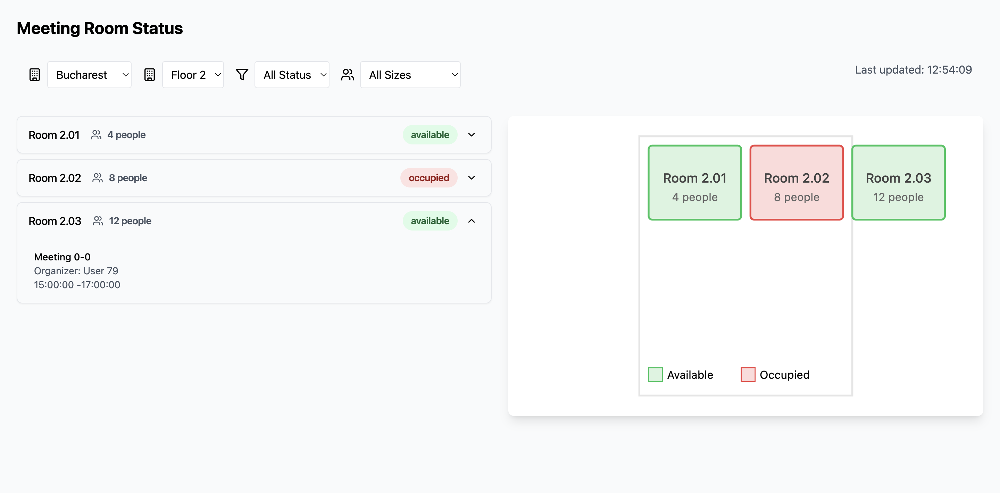
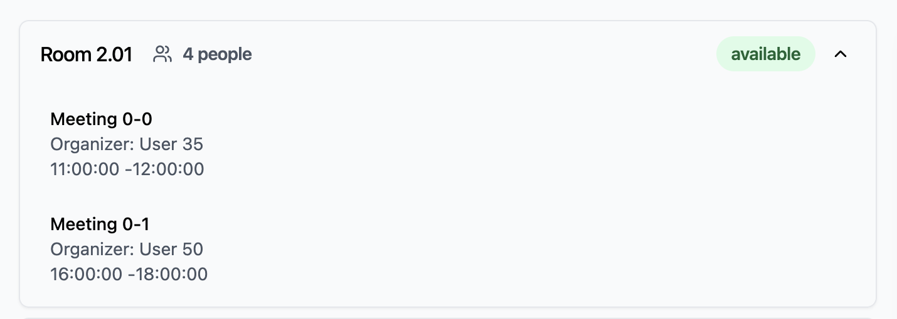
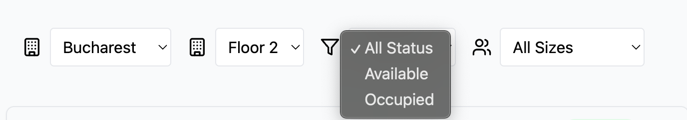
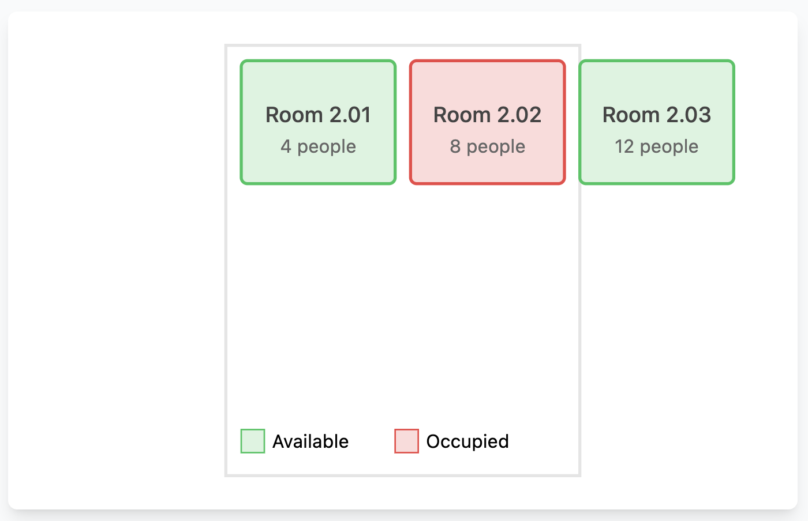

# Meeting Room Dashboard

A real-time meeting room availability dashboard that integrates with Microsoft Graph API to show room status, capacity, and schedules across multiple buildings and floors.


*Main dashboard showing room availability across floors*

## Features

- 🏢 Multi-building support
- 📍 Floor-by-floor room visualization
- 🔄 Real-time availability updates
- 📊 List and map views
- 🔍 Advanced filtering options:
    - By building
    - By floor
    - By room status
    - By room capacity
- 📅 Meeting schedule viewer
- 💡 Status indicators for room availability
- 👥 Room capacity information
- 🖥️ Equipment details


*Expanded view showing room details and today's schedule*

## Tech Stack

- Frontend:
    - React
    - Vite
    - Tailwind CSS
    - Lucide Icons
    - ShadcnUI Components

- Backend:
    - Node.js
    - Express
    - Microsoft Graph API Mock Server

## Getting Started

### Prerequisites

- Docker
- Docker Compose

### Installation

1. Clone the repository:
```bash
git clone git@github.com:qSharpy/meeting_rooms_dashboard.git
cd meeting_rooms_dashboard
```

2. Start the application using Docker Compose:
```bash
docker compose up --build
```

3. Access the application:
- Frontend: http://localhost:3000
- Mock API: http://localhost:3001


*Available filtering and sorting options*

## Project Structure

```
meeting_room_dashboards/
├── frontend/              # React frontend application
│   ├── src/
│   │   ├── components/    # React components
│   │   ├── services/     # API services
│   │   └── lib/          # Utility functions
│   └── ...
└── mock-graph-api/       # Mock Microsoft Graph API
    ├── src/
    │   ├── data/         # Mock data
    │   └── index.js      # API endpoints
    └── ...
```

## Features in Detail

### Real-time Updates
- Room availability status updates every 30 seconds
- Visual indicators for available/occupied rooms
- Last updated timestamp display

### Filtering System
- Building selection
- Floor-specific views
- Capacity filtering (small/medium/large rooms)
- Availability status filtering

### Room Information
- Room number and capacity
- Current status
- Available equipment
- Today's meeting schedule
- Meeting organizer details


*Interactive map view of rooms on selected floor* \
*This SVG is generated based on the rooms. I aim to have a floor map and draw on that one specifically*

## Development

### Frontend Development
```bash
cd frontend
npm install
npm run dev
```

### Backend Development
```bash
cd mock-graph-api
npm install
npm run dev
```

## Future Enhancements

- [ ] Microsoft Graph API integration
- [ ] Meeting duration indicators
- [ ] Room utilization statistics

## Contributing

1. Fork the repository
2. Create your feature branch (`git checkout -b feature/AmazingFeature`)
3. Commit your changes (`git commit -m 'Add some AmazingFeature'`)
4. Push to the branch (`git push origin feature/AmazingFeature`)
5. Open a Pull Request

## License

This project is licensed under the MIT License - see the [LICENSE](LICENSE) file for details.

---
